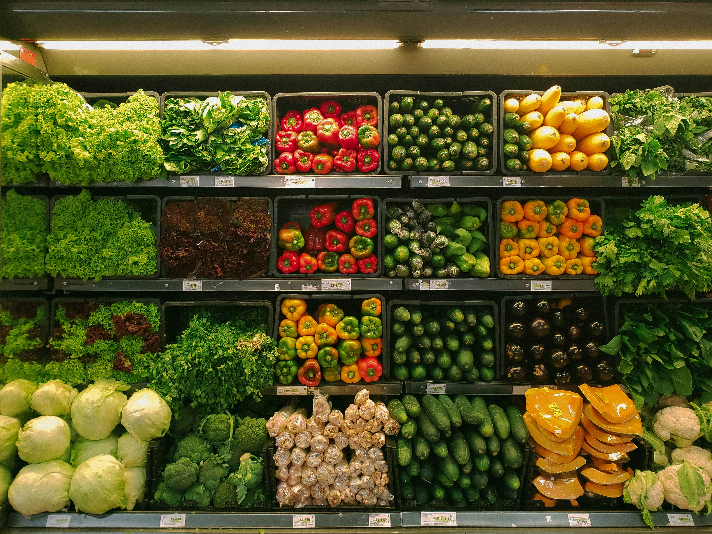
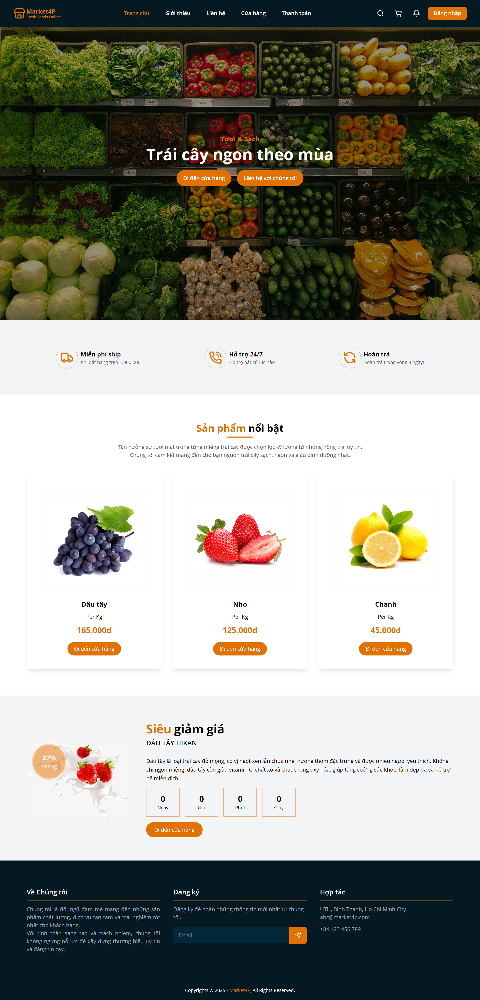
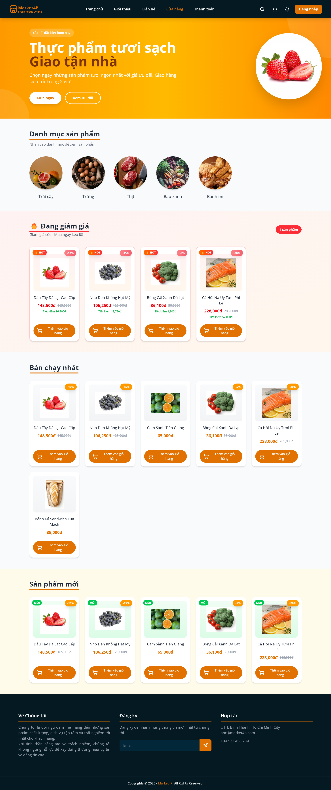
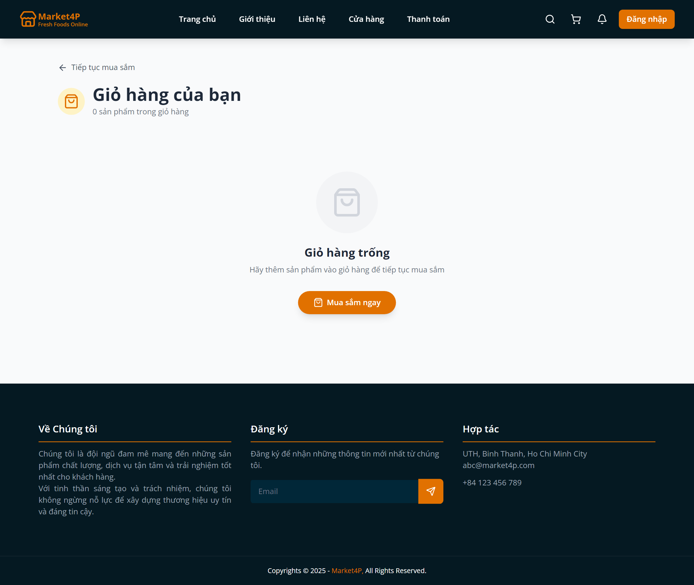
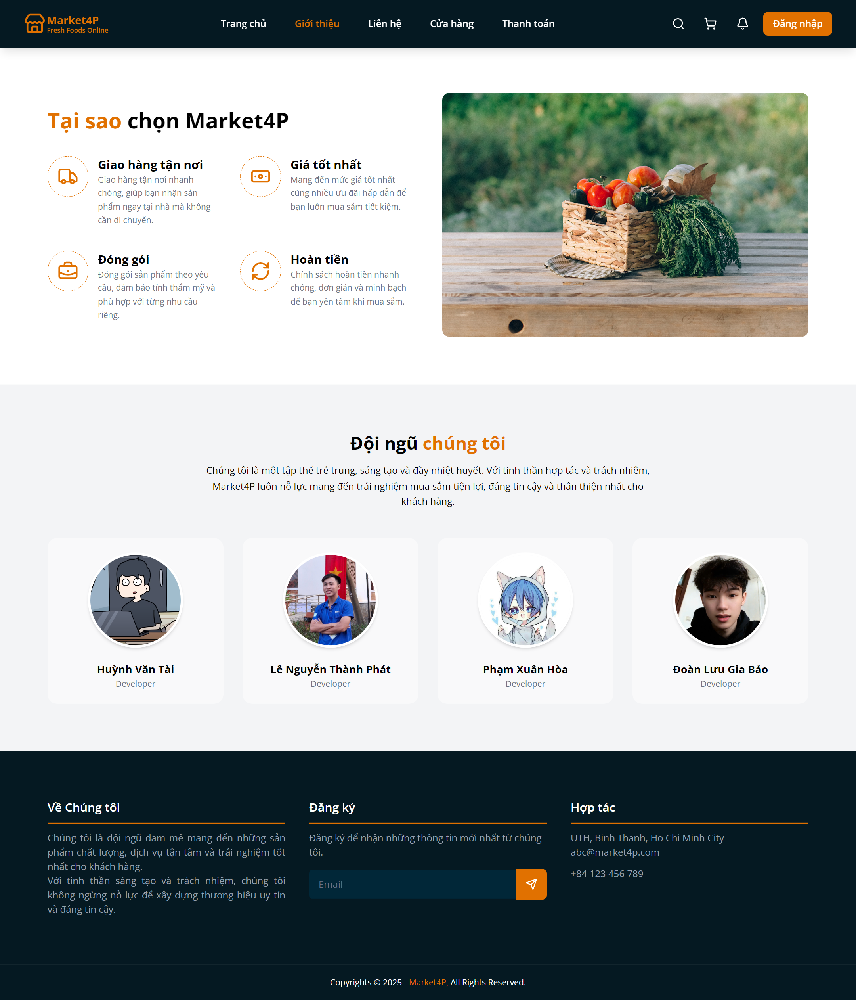
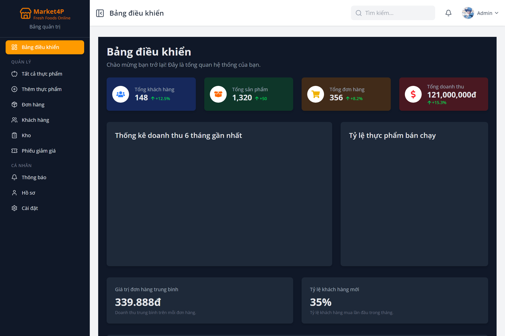
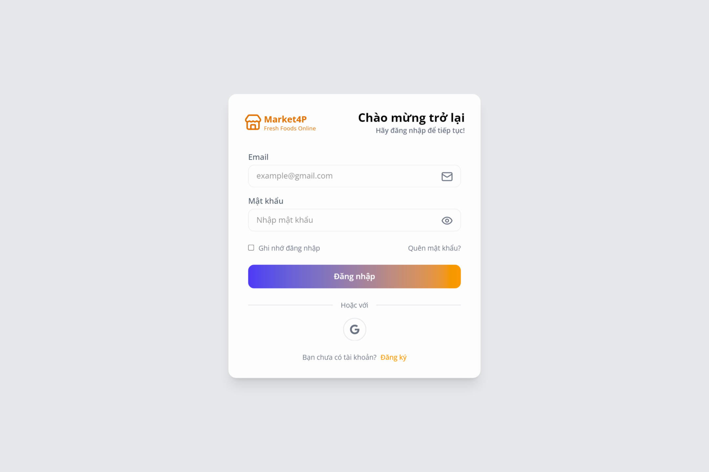

# Market4P - Fresh Produce & Clean Food E-Commerce Platform

<div align="center">
  

  <p align="center">
    <strong>A high-performance, full-stack MERN e-commerce application bringing fresh agricultural produce, organic vegetables, and clean groceries directly to consumers.</strong>
  </p>

  <p align="center">
    
    
    
    
    
    
    
  </p>
</div>

---

## 📑 Table of Contents

- [🌟 Project Overview](#-project-overview)
- [✨ Key Features](#-key-features)
  - [🛒 Customer Experience](#-customer-experience)
  - [🛡️ Admin Dashboard](#️-admin-dashboard)
- [📸 Screenshots & UI Preview](#-screenshots--ui-preview)
- [🏗️ Tech Stack & Architecture](#️-tech-stack--architecture)
- [📂 Project Structure](#-project-structure)
- [🚀 Getting Started](#-getting-started)
  - [Prerequisites](#prerequisites)
  - [1. Clone Repository](#1-clone-repository)
  - [2. Backend Configuration & Setup](#2-backend-configuration--setup)
  - [3. Frontend Setup](#3-frontend-setup)
  - [4. Seed Initial Admin Account](#4-seed-initial-admin-account)
- [🔐 Environment Variables](#-environment-variables)
- [📡 API Architecture](#-api-architecture)
- [👥 Core Development Team](#-core-development-team)
- [📄 License](#-license)

---

## 🌟 Project Overview

**Market4P** is a modern e-commerce web platform engineered to streamline the distribution of fresh, clean, and organic farm produce directly to end consumers. Built with a decoupled MERN architecture (MongoDB, Express, React, Node.js), the platform prioritizes fast load speeds, fluid scroll animations, intuitive shopping workflows, and a powerful real-time administrative management portal.

---

## ✨ Key Features

### 🛒 Customer Experience
- **Dynamic Homepage**: Features interactive hero banners, scroll animations (Framer Motion), promotional countdown timers, and curated fresh produce highlights.
- **Product Discovery & Smart Filtering**: Search catalog by name, filter by product categories, price ranges, and sort by relevance or popularity.
- **Interactive Shopping Cart**: Real-time quantity adjustments, price calculations, and coupon code redemptions.
- **Checkout & Order Management**: Multi-step checkout flow, multiple delivery address storage, and order history tracking with detailed status updates.
- **Real-Time Notifications**: Instant updates via Socket.IO for order status changes and system announcements.
- **Customer Reviews & Ratings**: Authentic customer feedback and star ratings on purchased products.
- **Responsive Design**: Mobile-first user experience optimized across smartphones, tablets, and desktop devices.

### 🛡️ Admin Dashboard
- **Analytics & Reporting**: Interactive data visualization powered by Chart.js for tracking daily revenue, total sales, active orders, and new customer registrations.
- **Catalog Management**: Add, update, and remove products with multi-image support hosted on Cloudinary.
- **Inventory Control**: Real-time stock status monitoring, stock alerts, and low-inventory tracking.
- **Order Processing**: Comprehensive order fulfillment workflow (Pending $\rightarrow$ Processing $\rightarrow$ Shipped $\rightarrow$ Delivered $\rightarrow$ Cancelled).
- **Customer Management**: View user profiles, transaction histories, and contact records.
- **Promotions & Coupons**: Create discount vouchers, set expiration periods, and monitor coupon redemptions.

---

## 📸 Screenshots & UI Preview

### 🏠 Customer Storefront Experience

#### 1. Home Page (`/`)
*Full landing page showcasing the interactive hero banner, store value proposition cards, featured organic fruits, flash sale promotion countdown timer, and comprehensive footer.*

<div align="center">
  
</div>

<br/>

#### 2. Shop & Fresh Produce Catalog (`/shop`)
*Explore fresh categories (Fruits, Eggs, Meat, Vegetables, Bread), live discounts with savings calculation tags, best-selling groceries, and newly added farm produce.*

<div align="center">
  
</div>

<br/>

#### 3. Shopping Cart & About Us

| Shopping Cart (`/cart`) | About Us & Team (`/about`) |
| :---: | :---: |
|  |  |
| *Real-time cart management & quick checkout* | *Why Choose Market4P & Core Engineering Team* |

<br/>

### 🛡️ Admin Dashboard & Authentication

| Admin Dashboard (`/admin/dashboard`) | Authentication (`/login`) |
| :---: | :---: |
|  |  |
| *KPI statistics, sales revenue, orders & category metrics* | *Secure authentication with password toggle & Google sign-in* |

> 💡 **Automated Screenshot Refresh:**
> To re-capture and automatically update all screenshots from the live application, run:
> ```bash
> cd Frontend
> npm run capture:screenshots
> ```

---

## 🏗️ Tech Stack & Architecture

```
┌────────────────────────────────────────────────────────┐
│                   React 19 + Vite                      │
│     (Tailwind CSS v4, Lucide Icons, Chart.js)          │
└──────────────────────────┬─────────────────────────────┘
                           │ HTTP / REST & WebSocket
                           ▼
┌────────────────────────────────────────────────────────┐
│                  Node.js + Express 5                   │
│     (JWT Auth, Helmet, Rate Limiter, Socket.IO)        │
└──────────────┬───────────────────────────┬─────────────┘
               │                           │
               ▼                           ▼
┌─────────────────────────────┐ ┌────────────────────────┐
│      MongoDB (Atlas)        │ │  Cloudinary API        │
│   (Mongoose ODM Models)     │ │  (Media & Asset CDN)   │
└─────────────────────────────┘ └────────────────────────┘
```

| Layer | Technologies |
| :--- | :--- |
| **Frontend** | React 19, Vite, Tailwind CSS v4, Framer Motion, React Router v7, Lucide React, Chart.js, React Hot Toast |
| **Backend** | Node.js, Express.js v5, Mongoose ODM, Socket.IO, Zod, Multer, Helmet, Morgan |
| **Database** | MongoDB Atlas (Cloud Database) |
| **Authentication** | JSON Web Tokens (JWT) & HTTP-Only Secure Cookies, Bcrypt.js |
| **Cloud Storage** | Cloudinary (Product & asset image hosting) |

---

## 📂 Project Structure

```bash
Market4P_gr/
├── Backend/                    # Express REST API & Real-time Server
│   ├── src/
│   │   ├── config/             # Cloudinary & environment configuration
│   │   ├── controllers/        # Request handlers (Auth, Product, Order, etc.)
│   │   ├── middlewares/        # Authentication, Error handling, Rate limiting
│   │   ├── models/             # Mongoose schemas (User, Product, Order, etc.)
│   │   ├── routes/             # Express route definitions
│   │   ├── app.js              # Express app setup & middleware pipeline
│   │   └── server.js           # Server entry point & DB connection
│   ├── seedAdmin.js            # Admin account initializer script
│   └── package.json
│
├── Frontend/                   # Client-side React Application
│   ├── public/                 # Static assets & favicon
│   ├── src/
│   │   ├── assets/             # Brand images and icons
│   │   ├── components/         # Reusable UI components (Navbar, Footer, Admin)
│   │   ├── context/            # React Context state management
│   │   ├── pages/              # View pages (Home, Shop, Cart, Checkout, Admin)
│   │   ├── routers/            # Route configuration (AppRouter)
│   │   ├── services/           # Axios HTTP client & API endpoints
│   │   ├── App.jsx             # Root layout component
│   │   └── main.jsx            # Application entry point
│   ├── vite.config.js          # Vite bundler configuration
│   └── package.json
│
├── Chatbot/                    # Intelligent assistant module (in development)
├── docs/                       # Project documentation & images
│   └── images/                 # Banners and UI screenshots
└── README.md
```

---

## 🚀 Getting Started

### Prerequisites
- **Node.js**: v18.0.0 or higher
- **npm** or **yarn**
- **MongoDB**: Local instance or MongoDB Atlas connection string

---

### 1. Clone Repository

```bash
git clone https://github.com/paiisenn/Market4P_gr.git
cd Market4P_gr
```

---

### 2. Backend Configuration & Setup

1. Navigate to the backend directory:
   ```bash
   cd Backend
   ```

2. Install dependencies:
   ```bash
   npm install
   ```

3. Configure environment variables:
   Create a `.env` file in `Backend/` (or copy from `.env.example`):
   ```bash
   cp .env.example .env
   ```
   Fill in your credentials:
   ```env
   PORT=5001
   NODE_ENV=development
   MONGODB_CONNECTIONSTRING=your_mongodb_connection_string
   CLIENT_URL=http://localhost:5173
   ACCESS_TOKEN_SECRET=your_jwt_secret_key
   CLOUDINARY_CLOUD_NAME=your_cloudinary_cloud_name
   CLOUDINARY_API_KEY=your_cloudinary_api_key
   CLOUDINARY_API_SECRET=your_cloudinary_api_secret
   ```

4. Start the backend development server:
   ```bash
   npm run dev
   ```
   The backend will be running at `http://localhost:5001`.

---

### 3. Frontend Setup

1. Open a new terminal and navigate to the frontend directory:
   ```bash
   cd Frontend
   ```

2. Install dependencies:
   ```bash
   npm install
   ```

3. Configure environment variables:
   Create a `.env` file in `Frontend/`:
   ```env
   VITE_API_URL=http://localhost:5001
   ```

4. Start the Vite development server:
   ```bash
   npm run dev
   ```
   The application will be accessible at `http://localhost:5173`.

---

### 4. Seed Initial Admin Account

To quickly access the Admin Dashboard, initialize the default administrator account:

```bash
cd Backend
node seedAdmin.js
```

Default credentials:
- **Email**: `admin001@gmail.com`
- **Password**: `admin123456789`

---

## 🔐 Environment Variables

### Backend (`Backend/.env`)
| Variable | Description | Example |
| :--- | :--- | :--- |
| `PORT` | Backend server port | `5001` |
| `NODE_ENV` | Environment mode | `development` / `production` |
| `MONGODB_CONNECTIONSTRING` | MongoDB Atlas URI | `mongodb+srv://...` |
| `CLIENT_URL` | Frontend origin for CORS | `http://localhost:5173` |
| `ACCESS_TOKEN_SECRET` | Secret key for signing JWT tokens | `your_secret_string` |
| `CLOUDINARY_CLOUD_NAME` | Cloudinary account name | `demo_cloud` |
| `CLOUDINARY_API_KEY` | Cloudinary API Key | `1234567890` |
| `CLOUDINARY_API_SECRET` | Cloudinary API Secret | `abcdef123456` |

### Frontend (`Frontend/.env`)
| Variable | Description | Example |
| :--- | :--- | :--- |
| `VITE_API_URL` | Base endpoint for Backend API | `http://localhost:5001` |

---

## 📡 API Architecture

| Method | Endpoint | Description | Access |
| :--- | :--- | :--- | :--- |
| `POST` | `/api/auth/register` | Register a new user | Public |
| `POST` | `/api/auth/login` | Authenticate user & issue JWT | Public |
| `GET` | `/api/products` | Retrieve list of products & filters | Public |
| `GET` | `/api/products/:id` | Retrieve product details | Public |
| `GET` | `/api/cart` | Get user shopping cart | Authenticated |
| `POST` | `/api/cart/add` | Add product to shopping cart | Authenticated |
| `POST` | `/api/orders` | Create a new purchase order | Authenticated |
| `GET` | `/api/orders/user` | Get orders for logged-in user | Authenticated |
| `GET` | `/api/admin/dashboard` | Get administrative metrics & stats | Admin Only |
| `POST` | `/api/admin/products` | Create a new product with images | Admin Only |
| `PUT` | `/api/admin/orders/:id` | Update status of order | Admin Only |

---

## 👥 Core Development Team

| Name | Role | Responsibilities |
| :--- | :--- | :--- |
| **Huỳnh Văn Tài** | Developer | Full-Stack Development, Core System & Architecture |
| **Lê Nguyễn Thành Phát** | Developer | Frontend UI/UX, Pages & Responsive Design |
| **Phạm Xuân Hòa** | Developer | Backend API, Database Architecture & Admin Features |
| **Đoàn Lưu Gia Bảo** | Developer | Client Features, Shopping Cart & Checkout Workflows |

---

## 📄 License

Distributed under the **MIT License**. See `LICENSE` for more information.

<div align="center">
  <sub>Built with ❤️ by the Market4P Development Team</sub>
</div>
